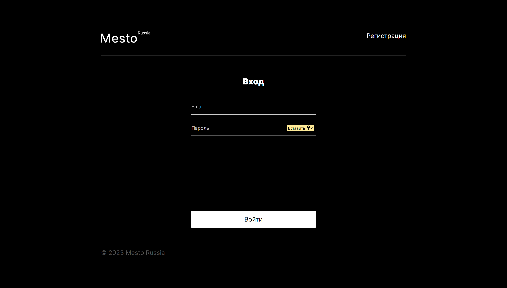
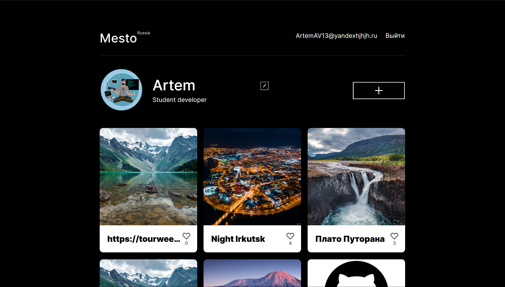

[](../../actions/workflows/tests.yml)

# Проект "React-mesto-api-full"🌍

<div align="center">
  
  
</div>

---
### 📜Описание:
В проекте задействованы две сущности: пользователи и карточки. Схемы и модели созданы через Mongoose с валидируемыми полями. Все роуты, кроме логина и логаута, защищены мидлвэрой auth, которая проверяет авторизацию и наличие токена в приходящих запросах. Обращение к API происходит через роуты с валидацией запросов через Joi и celebrate. В контроллерах описана логика обработки запросов. Контроллер логина создает JWT токен сроком на неделю. В контроллере регистрации пользователя пароль хешеруется модулем bcryptjs. В проекте реализована централизованная обработка ошибок через конструкторы ошибок - конструкторы передаются в блоках catch через функцию next и далее в мидлвэр обработки ошибок в app.js. Для логгирования запросов и ошибок используется библиотека Winston. Для разворачивания сервера используется облачный сервис Яндекс.Облако.

#### [Ссылка на репозиторий React-mesto-api-full](https://github.com/AsaevArtemV/react-mesto-api-full-gha)
 ---

### 🛠️Технологии:


---
### 🪄 Функционал:
1. Регистрация и авторизация🆔: Пользователи могут создать свой аккаунт, зарегистрировавшись с помощью электронной почты и пароля, либо войти в систему, используя свои учетные данные.

2. Редактирование профиля👤: Зарегистрированные пользователи могут изменять свое имя, статус и загружать собственное изображение в аватурку. Это позволяет пользователям настраивать свой профиль по своему усмотрению.

3. Создание и удаление карточек🌄: Пользователи могут создавать карточки с изображениями и названиями. Они также имеют возможность удалять свои карточки, которые им больше не нужны.

4. Лайки на карточках❤️: Пользователи могут выражать свое восхищение карточками, ставя лайк. Количество лайков отображается на каждой карточке.

5. Увеличение карточек по клику🔍: При клике на карточку она увеличивается для более детального просмотра. Это позволяет лучше рассмотреть изображение.

6. Взаимодействие с серверной частью🖥: Все данные о пользователях, карточках и профилях хранятся на сервере. Проект обеспечивает обмен данными с сервером для загрузки информации и сохранения изменений.

7. Модальные окна🪟: Пользователи могут открывать и закрывать модальные окна для выполнения различных действий, таких как редактирование профиля, добавление новой карточки, обновление аватара, увеличение фото и уведомления о регистрации.

🤩 Этот функционал делает проект Mesto react auth удобным и интерактивным, позволяя пользователям регистрироваться, создавать и редактировать профили, взаимодействовать с карточками, а также взаимодействовать с серверной частью для хранения данных.

---
### ⚙️Установка и запуск проекта:
1. Клонируйте репозиторий:

```
git clone git@github.com:AsaevArtemV/express-mesto-gha.git
```

2. Перейдите в директорию с проектом:

```
cd react-mesto-api-full
```

3. Установите зависимости:

```
npm install
```

4. Запустите сервер:

```
npm run start
```

5. Запустите сервер с hot-reload:

```
npm run dev
```

---

### 🔗Ссылки на проект:

Public IP: 51.250.73.162

* [Ссылка на Frontend часть проекта](https://mestoarteva.nomoredomains.xyz)

* [Ссылка на Backend часть проекта](https://mesto.arteva.nomoredomains.xyz)

* [Ссылка на макет в Figma с авторизацией](https://www.figma.com/file/5H3gsn5lIGPwzBPby9jAOo/JavaScript.-Sprint-12?type=design&node-id=0-1&mode=design)
